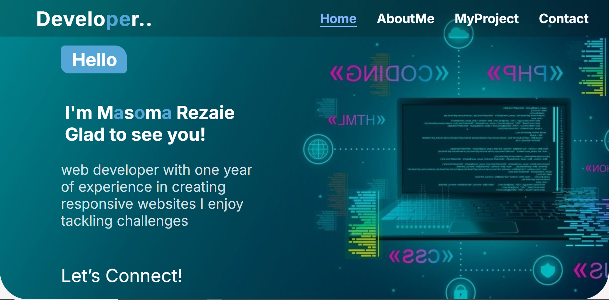

**Build-personal-portfolio** 🚀

**Project Description** 📝

Welcome to my portfolio website! This project is a detailed display of my web development skills, experiences, and achievements. It holds the code and resources for my personal portfolio website, featuring a range of projects, case studies, and blog posts that illustrate my web development expertise. The portfolio is crafted to give an overview of my professional path, highlighting my successes and showcasing my skills.
This project serves as a guide for developers, contributors, and users to understand the architecture, implementation details, and usage for the project. This project is built by html, css and Javascript. Trough creating this repository, users will learn the html,css and Javascript that how style and get functions to a webpage.
This project has four sections:
1. Header: This section is about a short bio of me. 
2. About Me: This section provide information about me, my works, expaiences, skills, and achivemnets. 
3. Projects: This section provide my projects details and live link.
4. Contact US: Through this section others can contact with me.

## Demo 📸

**How to use this project?**

for using this project you need to know a few commond first clone the repositry in yor local machine then go to the github directory . open the project on your IDE like vscode and start working on it .

1. go to the cmd and clone the Technical Documentation Page using this commond:

git clone https://github.com/MasomRezaie/Biuld_Personal_Portfolio 

2. go to the githu directory:

cd>Build_Personal_Portfolio

3. open the project on your IDE like vscode :

cd>Build_Personal_Portfolio

**This project is created:**
HTML
CSS
Javascript

**Installation:**
Install the required dependencies using git:
git install
Configuration: Configure [Project Name] by editing the config.git file.
create a hmlh file.
create a css file.
create a Javascript file.
link correctly the css and js file in html. (<link<link rel="stylesheet" href="./styles.css"> or 
</head>>)

## Technologies Used 🛠️
This project is built by:
- HTML
- CSS
-Javascript

## Installation 💻
first install git and create a github account.
Create a repositpry for this project.
clone the project in local machine.
use git comments like git add. git comment, and git push.
git add: it can add our project{git add (your file name)}
git commeit: it can commit the changes.
git push: it push the changes into github.

## Usage 🎯

To use this project, follow these instructions:
you neet to install 3 things:

chrombrowser
an IDE like vscode
git
node JS
Usage 🎯
for using this project you need to know a few commond first clone the repositry in yor local machine then go to the github directory . open the project on your IDE like vscode and start working on it .

go to the cmd and clone This project using this commond:

git clone https://github.com/Masoma Rezaie/Build pesrsonal Portfoilo.git 
go to the githu directory:

cd># Build pesrsonal Portfoilo
open the project on your IDE like vscode :

cd># Build pesrsonal Portfoilo .

# Figma Design link

https://www.figma.com/design/BFSpaGK7qdPXPwpVFzVANk/Ptotofolio?node-id=0-1&t=UPmjNIP0eM2e3MgI-1

## Author 👩‍💻

Masoma Rezaie.

- Website: [your-website.com](https://github.com/MasomRezaie/Personal-Portfolio-Page/tree/personal-portfolio-page)
- LinkedIn: [Miss Masoma](https://www.linkedin.com/in/miss-masoma-99b85522a?utm_source=share&utm_campaign=share_via&utm_content=profile&utm_medium=android_app)
- Email: [Masoma Rezaie](masom.rezaie135@gmail.com)

## Contributing 🤝
Design Idea By UX/UI Team:

Parwana Hassani👩‍💻

LinkedIn: [(https://www.linkedin.com/in/parwana-hassani-2b725b31b/?trk=opento_sprofile_goalscard)]

Zahra SADAT👩‍💻

LinkedIn: [(https://www.linkedin.com/in/zahra-sadat-42340a310)]

Muzhgan Alizada👩‍💻

LinkedIn: [(https://www.linkedin.com/in/muzhgan-alizada-314a72310?utm_source=share&utm_campaign=share_via&utm_content=profile&utm_medium=android_app)]

For contribution you can create a pull request and mention me there.Thank you.
